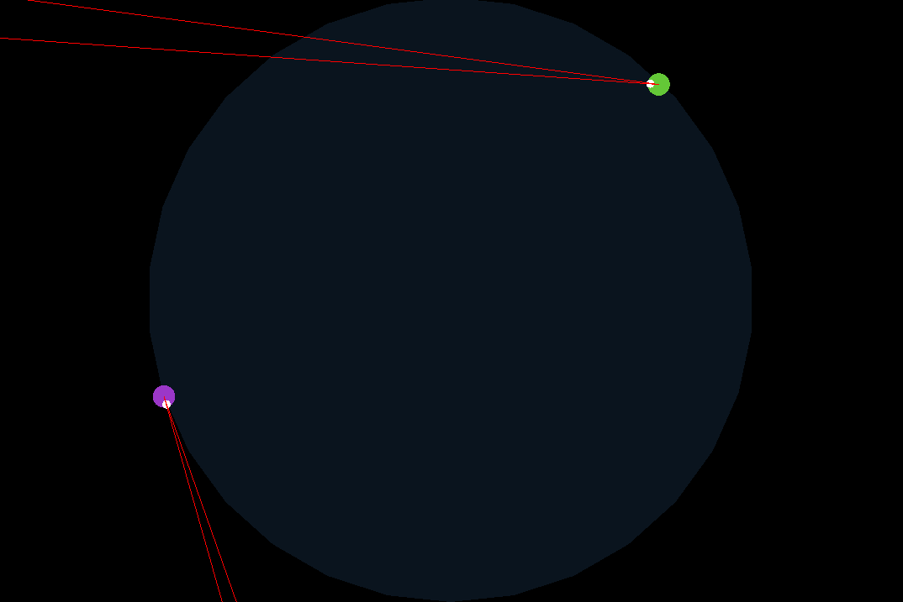
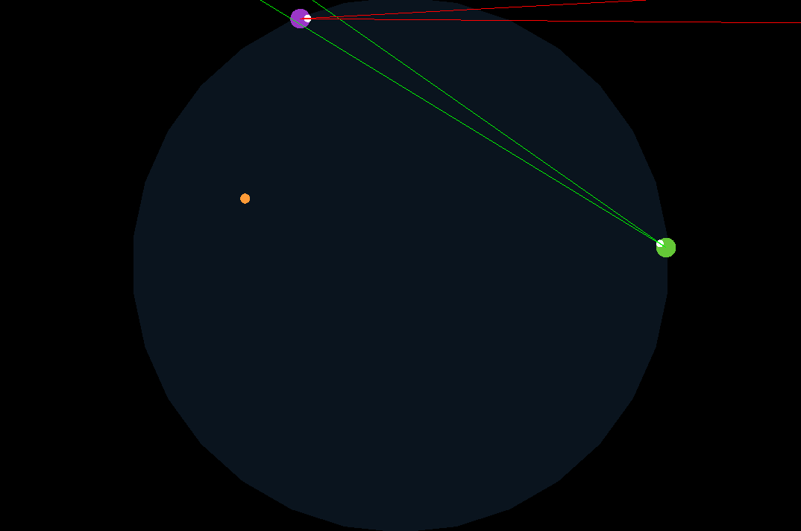

# ML-Arena
 Agents learn to fight using machine learning and genetic programming.

## How does it work ?
Each agent (a green/purple dot) has a "brain" which is a 3 layers fully connected neural network. At the first generation, all the "neurons" of the neural networks are instantiated randomly. At the end of each generation (every 30 seconds), the best agents of the population are selected, reproduced and mutated for creating a next generation of agents. The selection is tournament based, every agent fight each other, more the agent wins fights, more his chances of being selected are important. The use of a genetic algorithm allow slow improvements every generation, making the agents slightly better at aiming and shooting each generation.

## Controls

- Put mouse near an agent to see his stats
- Use Space to stop drawing the fight and speed up the programm
- Use S to show/hide the view rays

Generation 1 (Agents don't know how to  aim and shoot)

Generation 20 (Agents start aiming and shooting)
